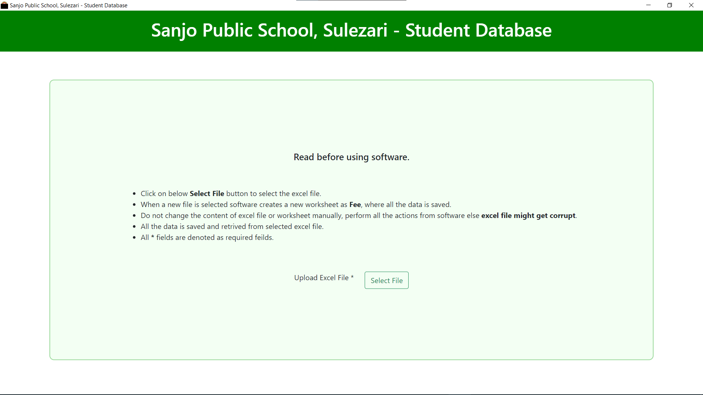
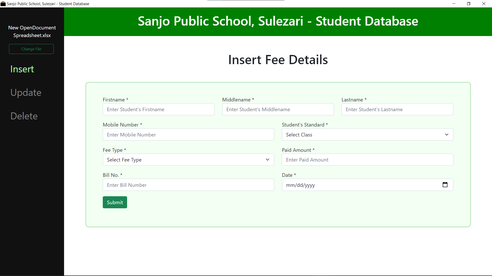
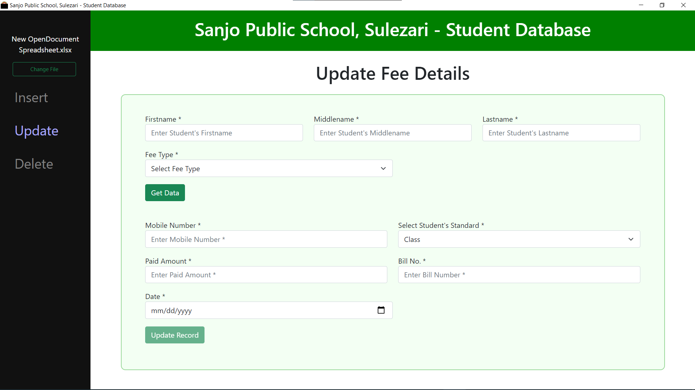
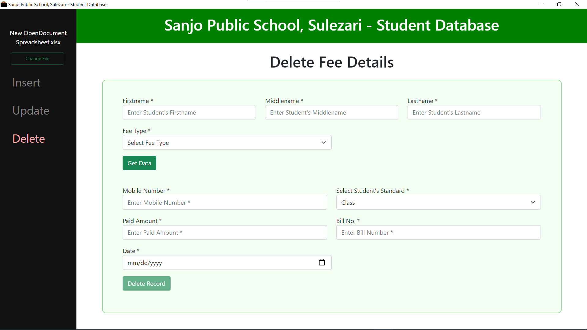

# Fee Management Software

## Made using <b>Electron.js</b> which is for cross-platform desktop apps with <b>JavaScript</b>, <b>HTML</b>, and <b>CSS.</b>

 

* ### <b>Home Page</b>

 

 

* ### <b>Insert Page</b>

 

 

* ### <b>Update Page</b>

 

 

* ### <b>Delete Page</b>

 